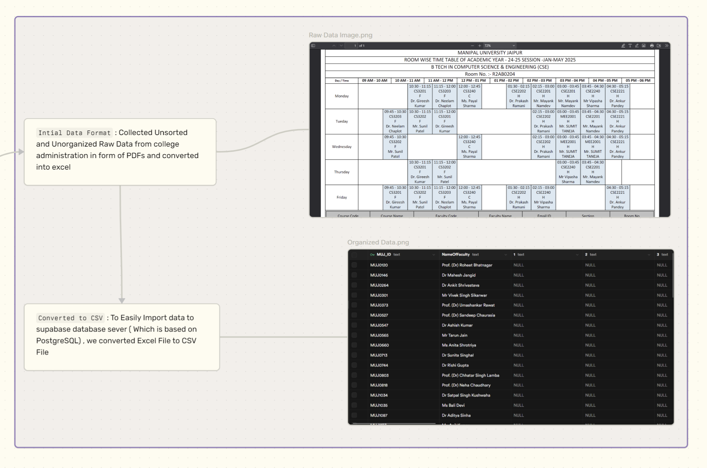
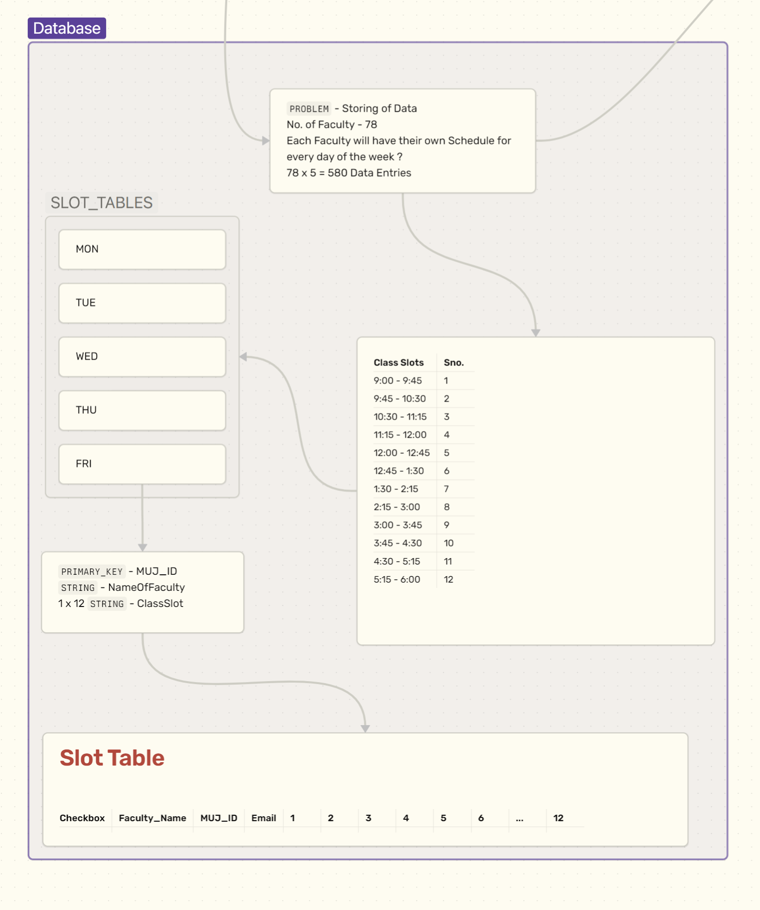
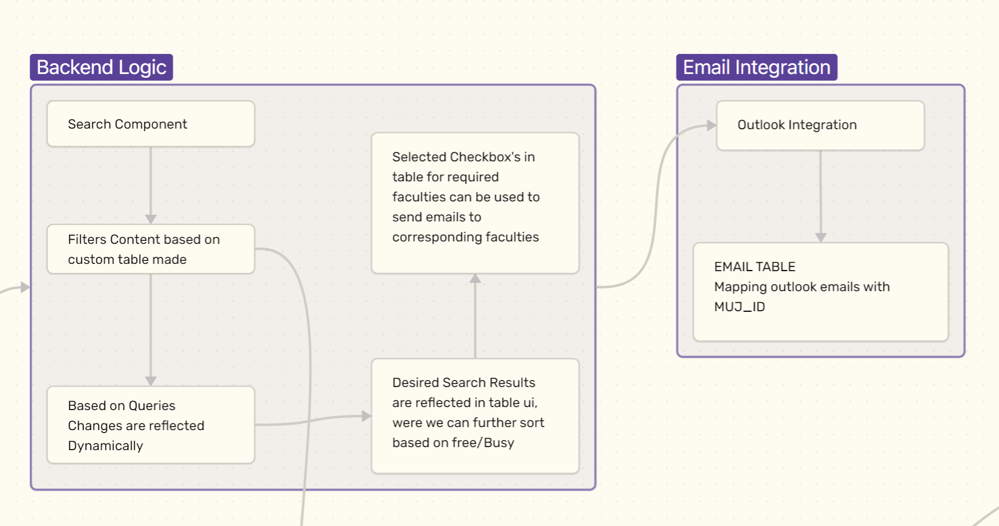
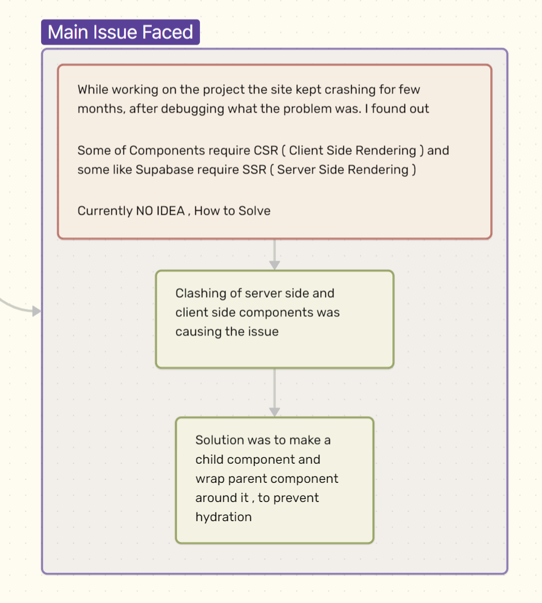
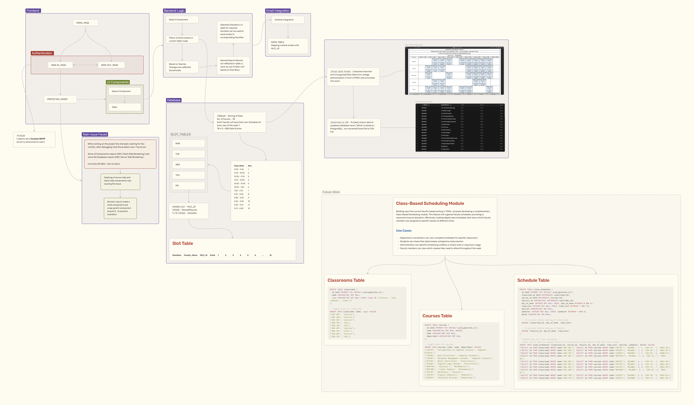

## Prelude

Imagine a scenario where a senior faculty member needs to urgently convene a curriculum planning meeting. They spend hours calling colleagues individually, only to discover conflicting schedules: some are teaching classes, others are in lab sessions, and a few are away for research commitments. 

This frustrating situation highlights a critical need in academic institutions an efficient way to view faculty availability in real-time. Our Faculty Availability Management System directly addresses this challenge by providing an intuitive platform that displays faculty schedules and contact information at a glance, eliminating the guesswork from meeting coordination while respecting faculty members' existing commitments.

Faculty members often waste too much time trying to arrange meetings using outdated methods like group emails and paper schedules. This common problem leads to mix-ups, last-minute changes, and stress for busy educators. 

I created this system to give colleges a smarter way to check who's available instantly, like having a shared digital calendar that everyone can see.

## Teacher Slot Availability System TSAS

The TSAS was built to solve everyday problems that schools and colleges face when trying to coordinate faculty schedules. The biggest challenge has always been **finding available faculty** during specific times what used to require hours of phone calls and emails can now be done in minutes through a simple digital interface. This connects directly to another major issue: **seeing faculty schedules across all departments** in real-time. Instead of each department working in isolation, everyone can now see who's free without having to contact multiple people.

Communication has always been a pain point in academic scheduling. The system addresses this by **enabling instant messaging to multiple faculty members at once** through built-in email features, eliminating the need to contact each person individually. This naturally helps **reduce scheduling mix-ups** and cuts down on the endless paperwork that used to consume administrative time. Behind all these features, the system **automatically keeps everything up-to-date**, ensuring faculty schedules reflect real-time changes without manual updates.

  
Checkout Youtube Link for Demo

  <a 
    href="https://www.youtube.com/watch?v=wLz_1mijT1Q" 
    target="_blank" 
    rel="noopener noreferrer"
    class="relative block group transition-transform duration-200 w-full max-w-96"
  >
    
    

      

        <svg class="w-8 h-8 text-white ml-1" fill="currentColor" viewBox="0 0 24 24">
          <path d="M8 5v14l11-7z"/>
        </svg>
      

    

  </a>

### How it works

This scheduling tool helps school administrators quickly find available faculty through an easy-to-use interface. Users pick a date and time (like Tuesday between 10:30 AM and 12:00 PM) and instantly see who's available using simple color codes green means free, red means busy along with contact information right there on the screen.

The system connects with existing school schedules and works through three main features that make faculty coordination much easier. **Time Checking** is the heart of how the system works. It breaks down each day into 45-minute chunks from 9 AM to 6 PM, which matches how long most classes and meetings last. This detailed breakdown helps administrators find even short time slots when faculty might be available for quick meetings or discussions.

The **Smart Search** feature makes finding the right faculty incredibly easy. You can sort faculty by their department (like Math or English) and see only those who are available at the same time. Whether you need science faculty for a Wednesday afternoon meeting or want to form a committee with people from different departments, the search gives you exactly what you need in seconds.

The **Group Messaging** feature might be the biggest time-saver of all. Instead of calling or emailing each faculty member separately, you can select multiple available faculty from your search results and send one message to everyone at once. This means meeting invitations, important announcements, or schedule changes can reach the right people instantly, saving hours of individual outreach.

During the development of the TSAS Faculty Availability Management System, one of the most persistent challenges was the site's frequent crashes, which plagued the project for several months. After extensive debugging, I discovered the root cause: a clash between client-side rendering (CSR) components and server-side rendering (SSR) requirements, particularly with Supabase integrations that demanded SSR while other parts favored CSR. Initially stumped with no clear solution in sight, the breakthrough came from restructuring the code creating dedicated child components and wrapping them within parent components to avoid hydration errors, ensuring seamless rendering and stability across the application. This fix not only resolved the crashes but also highlighted the nuances of mixing rendering strategies in modern web development.

These features work together to turn the headache of coordinating faculty schedules into something that takes just a few clicks, freeing up time for more important educational work.

## Conclusion: Transforming Academic Administration

The Faculty Availability Management System addresses a fundamental challenge that has persisted in academic institutions for decades. By replacing the frustrating cycle of phone calls, emails, and scheduling conflicts with an elegant digital solution, the system allows faculty members to focus on their core mission—advancing education and research.

This project demonstrates that effective solutions don't always require massive, expensive systems. Sometimes, the most impactful innovations come from thoughtfully applying modern technology to solve everyday problems that everyone experiences but few address systematically.

As academic institutions continue their digital transformation journey, the TSAS system serves as a compelling example of how targeted technology solutions can create significant operational improvements while enhancing the overall faculty experience. The success of this approach opens doors for similar innovations across other areas of academic administration, proving that with the right vision and execution, even long-standing institutional challenges can be transformed through intelligent software development.