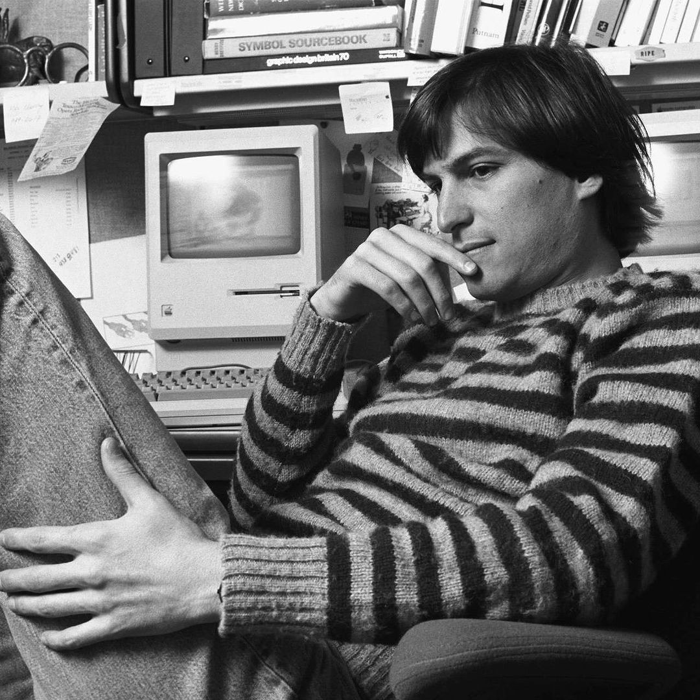
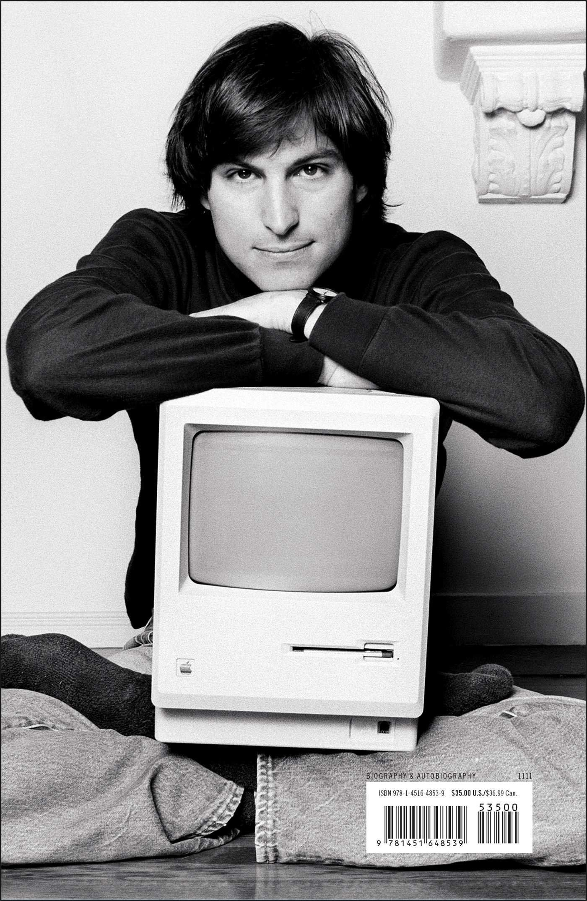
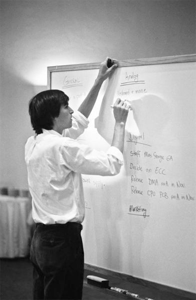

## Prologue

I've been asking this question more frequently since beginning my software development journey then ever now. It's one of the things that intrigued me to start my career in engineering in the first place.

Many people I know aren't interested in this topic, but why would they. I mean realistically speaking, how can a product succeed and talked about when everything launching on Product Hunt every other week is so polished that it out competes others.

We are not talking about months, years, or decades - we are talking about weeks. We are at a point in time where creating a good product is easier than ever before. However, making it successful is an entirely different matter.

## Steve

Steve Jobs had a well-defined vision and philosophy when it came to product creation. His approach to product development ultimately led to the establishment of one of the largest tech companies in the world: Apple.

  

  <a 
    href="https://www.youtube.com/watch?v=Qdplq4cj76I" 
    target="_blank" 
    rel="noopener noreferrer"
    class="relative block group hover:scale-105 transition-transform duration-200"
  >
    
    

      

        <svg class="w-8 h-8 text-white ml-1" fill="currentColor" viewBox="0 0 24 24">
          <path d="M8 5v14l11-7z"/>
        </svg>
      

    

  </a>
  <a 
    href="https://www.youtube.com/watch?v=XbkMcvnNq3g" 
    target="_blank" 
    rel="noopener noreferrer"
    class="relative block group hover:scale-105 transition-transform duration-200"
  >
    
    

      

        <svg class="w-8 h-8 text-white ml-1" fill="currentColor" viewBox="0 0 24 24">
          <path d="M8 5v14l11-7z"/>
        </svg>
      

    

  </a>

## Core Beliefs Behind His Design and User Experience

### Simplicity is the Ultimate Sophistication

This isn't just about making things look minimal , it's about stripping away the unnecessary to reveal the essential. If a user needs a manual to understand how to use your product, the design has failed. The goal is to make interactions so intuitive they feel obvious. It's about eliminating confusing buttons, hidden features, and convoluted workflows, leaving only what's truly needed for a seamless experience.

### Question Everything About the Current Design

Innovation rarely comes from accepting the status quo. A crucial belief is the willingness to challenge every assumption about how things "should" be done. Why is this button here? Is this the most efficient way to achieve this task? Thinking differently and being willing to break from conventional wisdom are essential for pushing boundaries and creating something truly new and better.

### Start with the User Experience, Then Work Backwards to the Technology

Design is far more than just aesthetics. It's fundamentally about how a product works, how a user interacts with it, and how it makes them feel. The technology should serve the user experience, not dictate it. Every interaction should be designed to feel natural, efficient, and even delightful. The ultimate aim is often to make the technology invisible, allowing the user to focus on their task without being distracted by complex interfaces.

  

### Perfection in Details Matters

The difference between a good product and a great one often lies in the details. Obsessing over every pixel, every animation, and every subtle transition can elevate an experience from functional to exceptional. This commitment to quality extends beyond what the user sees; the underlying architecture and "the parts you can't see" should be crafted with the same level of care and precision. Quality must permeate every layer of the product.

### Create Products People Don't Know They Need Yet

True innovation isn't always born from market research asking users what they want today. Often, it's about envisioning a future and creating something that addresses needs users haven't even articulated yet. As the saying goes, if you ask customers what they want, they might just say "better horses" when what they really need is an automobile. This belief requires foresight, courage, and the ability to show people the future.

  

### Integration of Hardware and Software

For a truly cohesive and powerful user experience, controlling the entire stack from the physical device to the software that runs on it – can be crucial. When hardware and software are designed to work together seamlessly, the potential for friction and compromise is minimized. This integrated approach allows for a more unified vision and a higher level of polish.

### Say No to 1,000 Things

Focus is not about saying yes to everything; it's about having the discipline to say no to many good ideas in pursuit of a few exceptional ones. Trying to do too many things adequately often results in mediocrity across the board. The belief here is in doing a limited number of things exceptionally well, and having the courage to kill projects that don't meet the highest standards of quality and vision.

### Prototype and Iterate

Design is an iterative process, not a single event. Bringing ideas to life through working prototypes is essential for testing, refining, and understanding how a product truly feels in the hands of users. This involves continuous refinement and a willingness to go back to the drawing board if necessary until the experience feels absolutely right. Don't be afraid to restart if the current path isn't leading to perfection.